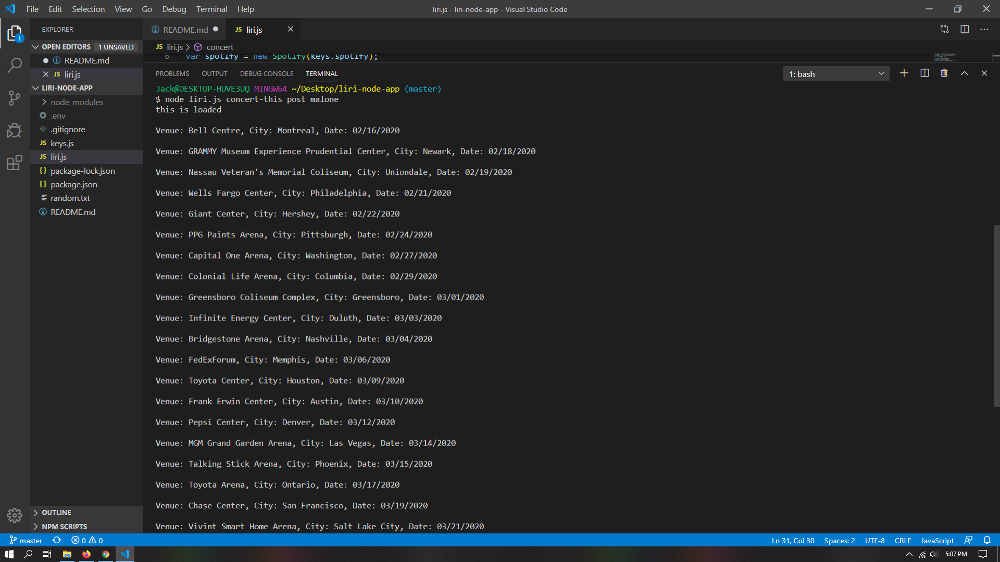
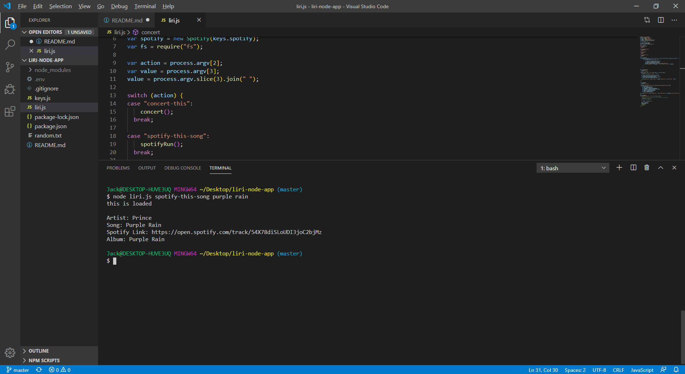
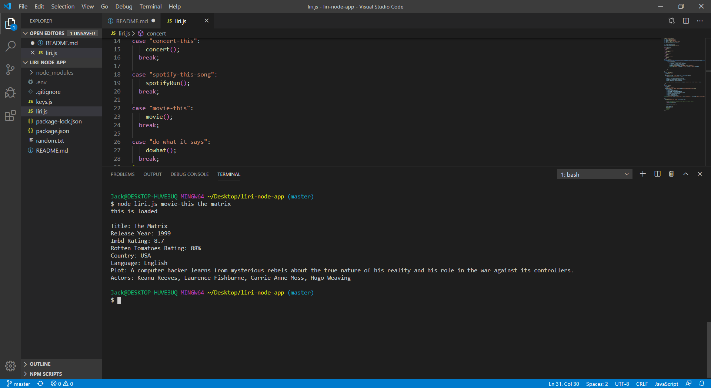
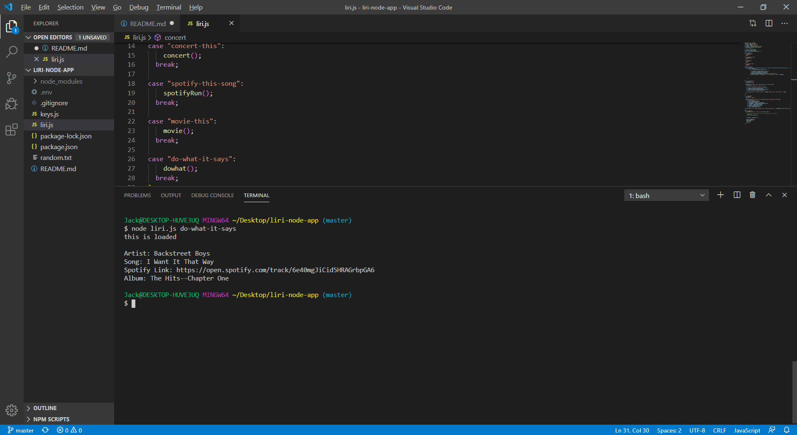

# liri-node-app
# images 

1. This app takes in specific user phrases and either a band, a song, or a movie and returns useful results in the console.
2. The app in split into functions depending on what the user inputs into the command line
3. To run the app install npm to get the required packages. In the console type "node liri.js" one of the following phrases "concert-this", "spotify-this-song", "movie-this", "do-what-it-says".  For the first three also include the artist, song name, or movie that you wish to search for. ex.(node liri.js concert-this Drake)
4. Technologies used:
    *Node-Spotify-api
    *Axios
    *OMDB api
    *Bands in town API
    *Moment
    *DotEnv
5. I(Jack Lawless) was the sole developer for this project

Deployed link  https://soblique.github.io/liri-node-app/